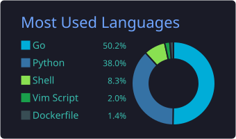

  

<h2 align="center">About Me</h2>

  🎯 Future Cloud/DevOps Engineer 
  ☸️ Kubestronaut In Progress 
  🏠 Building &amp; Breaking Things Within My Homelab 
  🧪 Labs, Scripts, &amp; Experiments Live <a href="https://github.com/umbra-codex/lab">Here!</a>

<h2 align="center">Tech Stack</h2>

  
  
  
  
  
  

  
  
  
  
  
  

<h2 align="center">GitHub Stats</h2>

  

  
  

  

<h2 align="center">Contact Me</h2>

  
  
  
  

