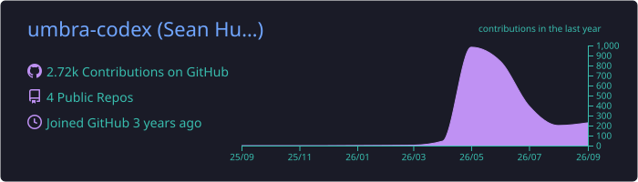
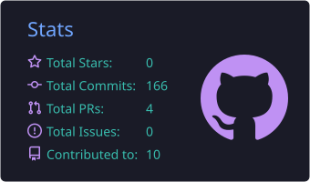
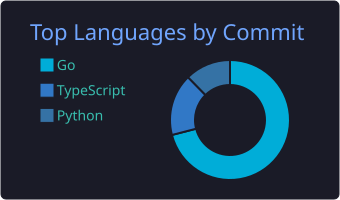

  

  

  
  
  

## About Me

- 🎯 Looking for my first DevOps / platform engineering role
- ☸️ Kubestronaut In Progress
- 🏠 Building & Breaking Things on my homelab (Arch + Hyprland)
- 🧪 Labs, Scripts, & Experiments Live [Here!](https://github.com/umbra-codex/lab)

## Tech Stack

  
  
  
  
  
  

  
  
  
  
  
  

## GitHub Stats

  

  
  

  

  

  

